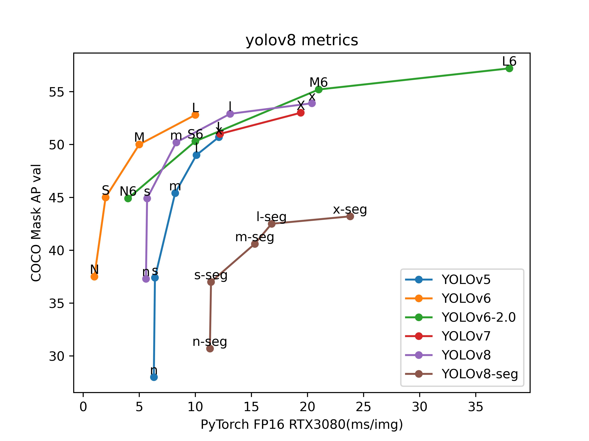

# model-metrics-plot


model-metrics-plot(mmplot)

[English](README.md) | [简体中文](README.zh-CN.md)

---
[](https://github.com/isLinXu/model-metrics-plot)  


## 😎 About

This project is developed based on libraries such as Pandas and Matplotlib, and can be used to draw line graphs of multiple index parameters such as algorithm accuracy and speed of multiple deep learning models.

---

## 🥰Result

### data review


### plot result

- data：data/Pytorch_models_data.csv

> 

data：data：data/PaddleYOLO_models_data.csv

> 

---

## 🔨Usage

### requirement

```shell
pip install matplotlib
pip install pandas
```

### run

```shell
git clone git@github.com:isLinXu/model-metrics-plot.git
cd model-metrics-plot
```

```shell
python3 main.py
```

or use your custom data csv

```shell
 python3 main.py -c 'csv_path' -n 'figture_name' -t 'title_name' -x 'xlabel_name' -y 'ylabel_name' -f font_size
```

```shell
 python3 main.py -c data/model_data.csv -n 'plot.jpg' -t 'MS COCO Object Detection' -x 'PyTorch FP16 RTX3080(ms/img)' -y 'COCO Mask AP val' -f '10'
```

