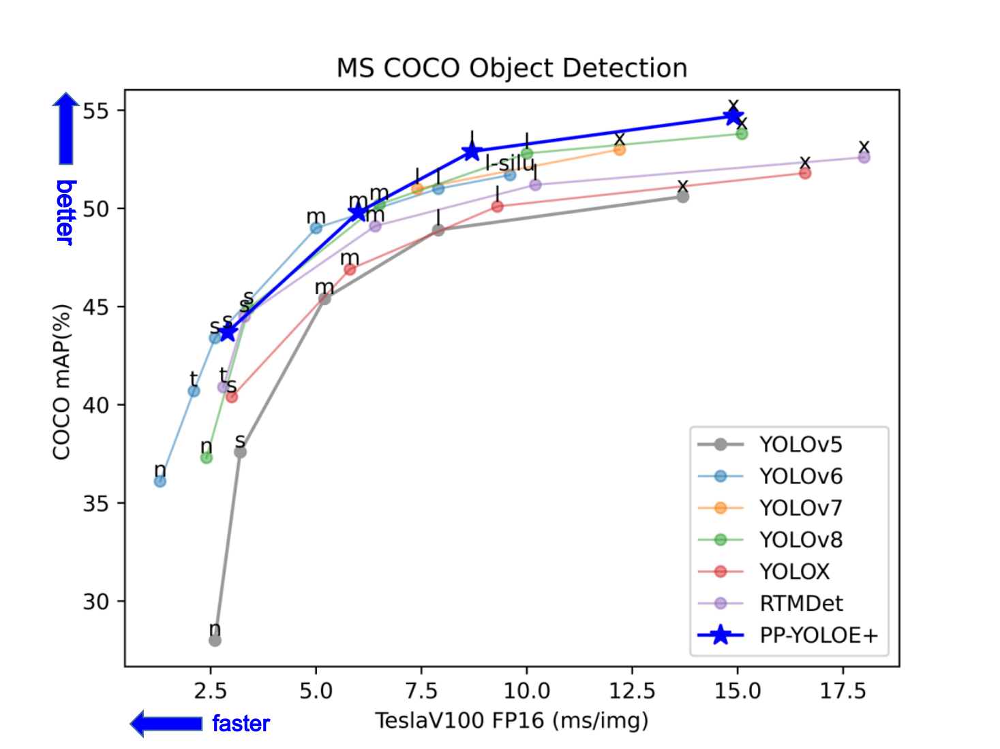
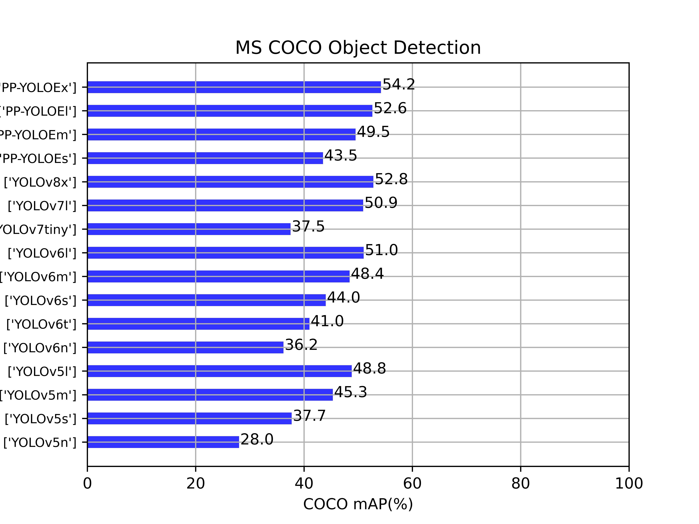
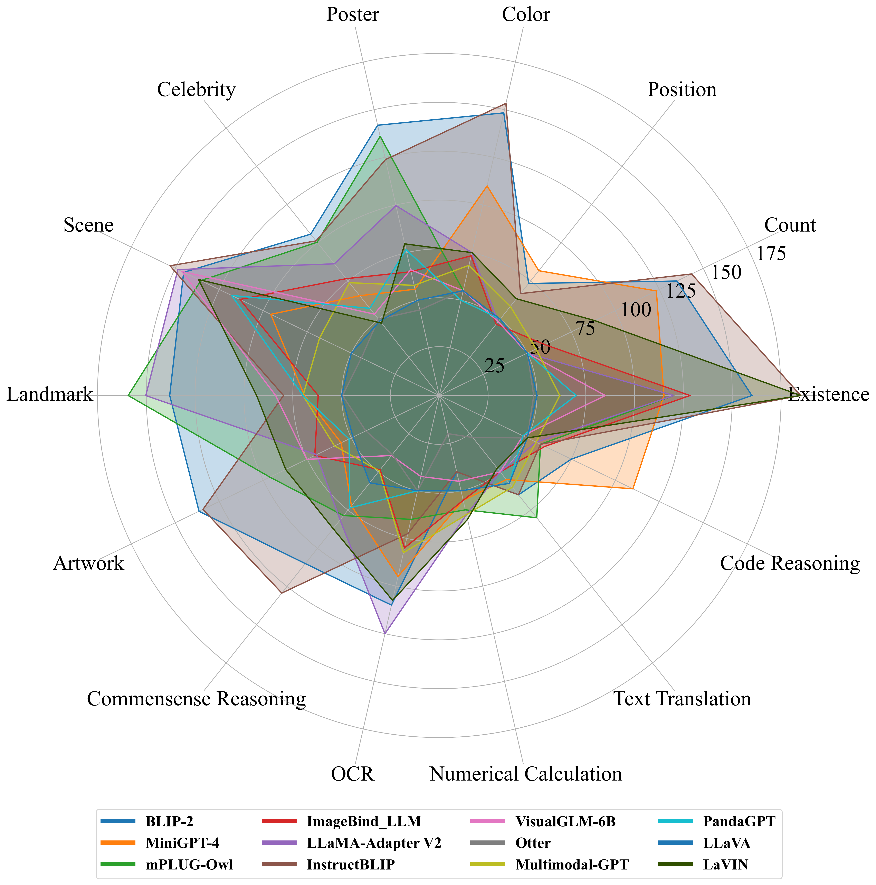

# model-metrics-plot


model-metrics-plot(mmplot)

[English](README.md) | [简体中文](README.zh-CN.md)

---
   
 [](https://github.com/isLinXu/model-metrics-plot)      

## 😎 About

This project is developed based on libraries such as Pandas and Matplotlib, and can be used to draw line graphs of multiple index parameters such as algorithm accuracy and speed of multiple deep learning models.

## features
use csv data to plot
- [x] line plot
- [x] bar plot
- [x] radar plot
- [x] tree plot
- [x] custom plot

---

## 🥰Result

### plot

|        |                            |     |
| ------------------------------------------------------------ | ------------------------------------------------------------ | ------------------------------------------------------------ |
| [data/Pytorch_models_data.csv](https://github.com/isLinXu/model-metrics-plot/blob/main/data/Pytorch_models_data.csv) | [data/PaddleYOLO_models_data.csv](https://github.com/isLinXu/model-metrics-plot/blob/main/data/PaddleYOLO_model_data.csv) | [data/MMYOLO_model_data.csv](https://github.com/isLinXu/model-metrics-plot/blob/main/data/MMYOLO_model_data.csv) |

|  |  |                                             |
|-----------------------------------------------------------------------------------------------------------------------------------------------|----------------------------------------------------------------------------------------------------------------------------|----------------------------------------------------------------------------------------------------------------------------|
| [data/llm_eval_data.csv](https://github.com/isLinXu/model-metrics-plot/blob/main/data/llm_eval_data.csv)                                      | [data/tree.json](https://github.com/isLinXu/model-metrics-plot/blob/main/data/tree.json)                                   |                                                                                                                            |
|  |  |  |
|                     |  |                                                                                                                            |

---

## 🔨Usage

### requirement

```shell
pip install matplotlib
pip install pandas
```

### mmplot install

```shell
git clone git@github.com:isLinXu/model-metrics-plot.git
cd model-metrics-plot
```

```shell
pip install -e .
```

### run

```shell
python3 main.py
```

or use your custom data csv

```shell
 python3 main.py -c 'csv_path' -n 'figture_name' -p 'plot_type' -t 'title_name' -x 'xlabel_name' -y 'ylabel_name' -f font_size -g False -v 'value_type' -r 'colors' 
```

#### line

> python3 main.py -c data/model_data.csv -n 'plot.jpg' -p 'line' -t 'MS COCO Object Detection' -x 'PyTorch FP16 RTX3080(ms/img)' -y 'COCO Mask AP val' -f 10 -v 'mAP' -r '#0000FF'
>

```shell
python3 main.py -c data/PaddleYOLO_extra_model_data.csv -n 'plot.jpg' -p 'line' -t 'MS COCO Object Detection' -x 'PyTorch FP16 RTX3080(ms/img)' -y 'COCO Mask AP val' -f 10 -v 'mAP' -r '#0000FF'
```


#### bar

```shell
python3 main.py -c data/MMYOLO_model_data.csv -p bar
```


#### radar


```shell
python3 main.py -c data/mllm_acc_eval-csv1029.csv -p radar
```


#### tree


