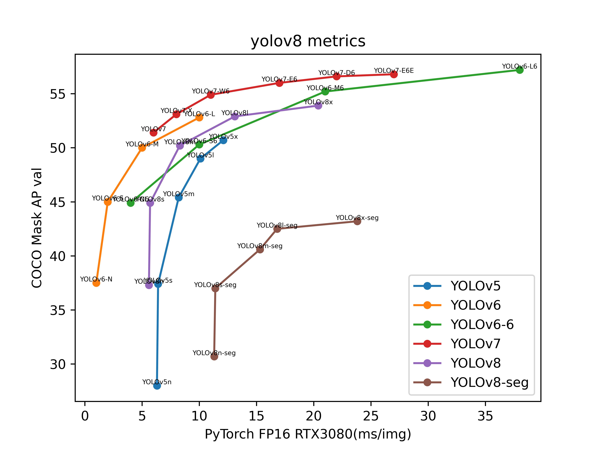
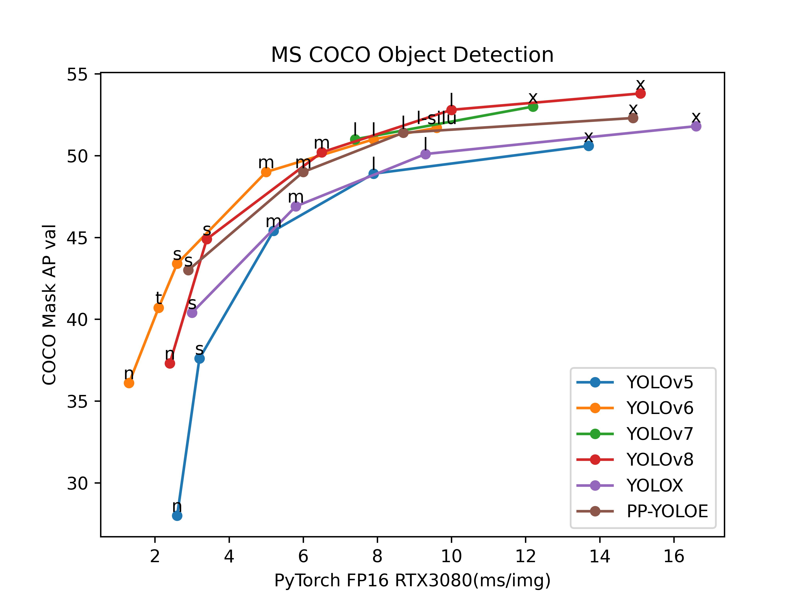
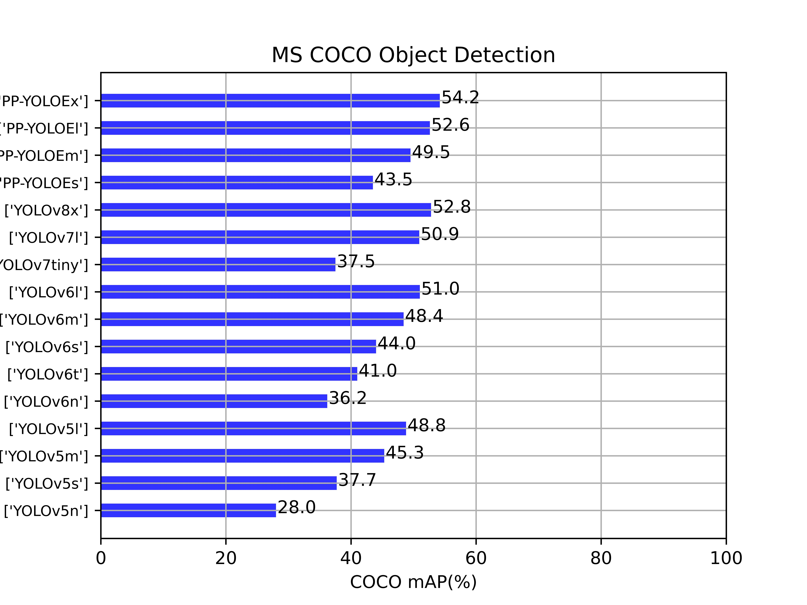
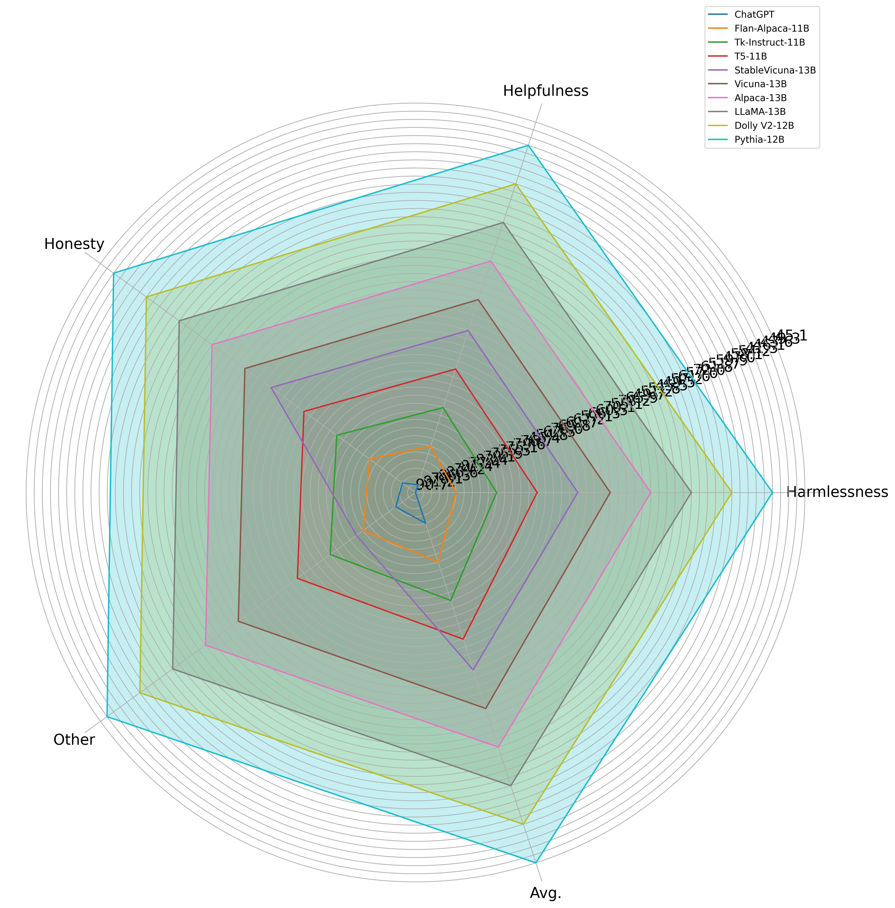
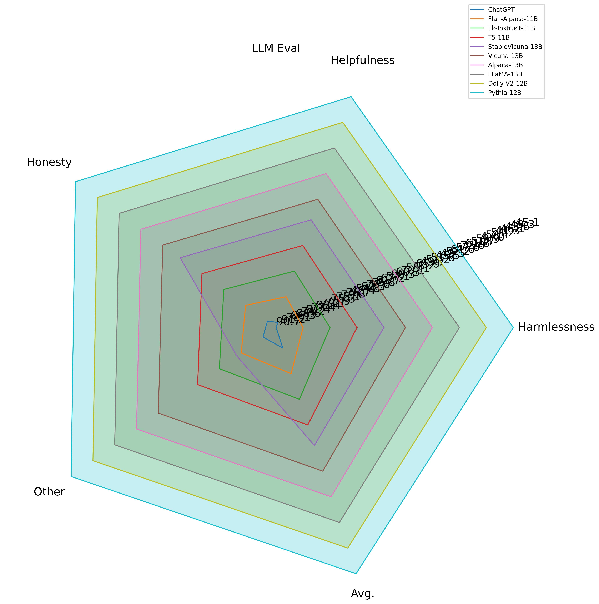
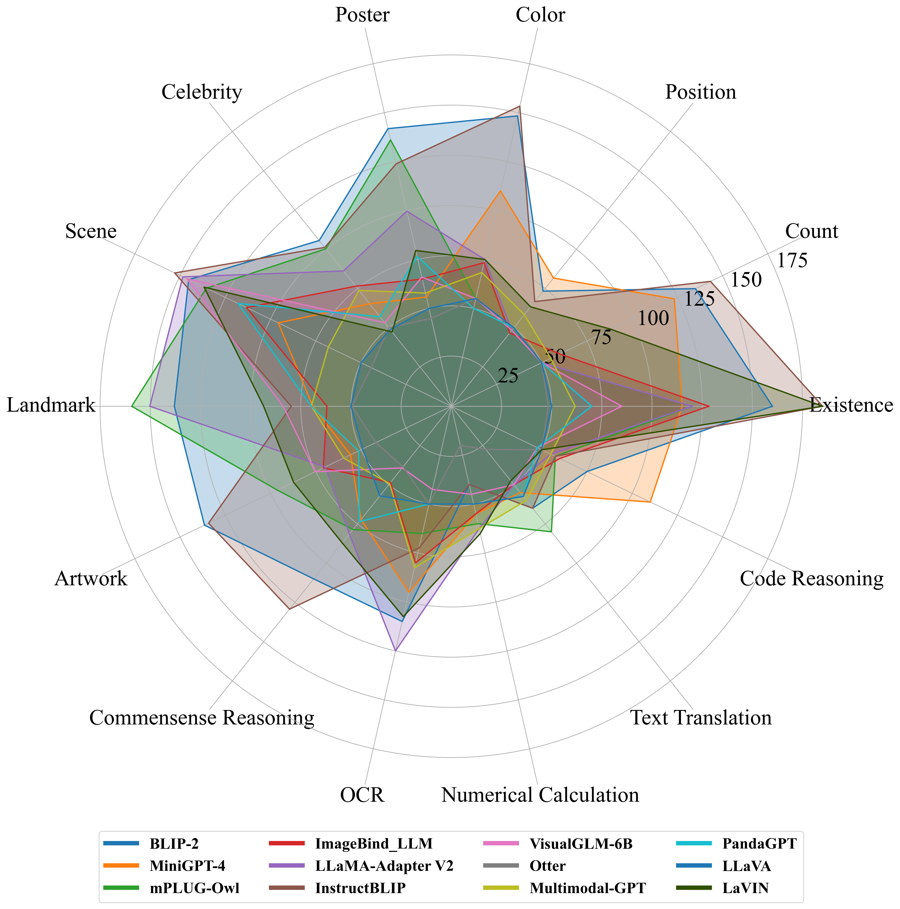

# model-metrics-plot


model-metrics-plot(mmplot)

[English](README.md) | [简体中文](README.zh-CN.md)

---
   
 [](https://github.com/isLinXu/model-metrics-plot)      

## 😎 介绍

本项目基于Pandas、Matplotlib等库开发，可用于绘制多个深度学习模型的算法精度、速度等多个指标参数的折线图。

---

## 🥰结果

### 绘制结果

|        |                            |     |
| ------------------------------------------------------------ | ------------------------------------------------------------ | ------------------------------------------------------------ |
| [data/Pytorch_models_data.csv](https://github.com/isLinXu/model-metrics-plot/blob/main/data/Pytorch_models_data.csv) | [data/PaddleYOLO_models_data.csv](https://github.com/isLinXu/model-metrics-plot/blob/main/data/PaddleYOLO_model_data.csv) | [data/MMYOLO_model_data.csv](https://github.com/isLinXu/model-metrics-plot/blob/main/data/MMYOLO_model_data.csv) |

|     |  |  |
| ------------------------------------------------------------ | ------------------------------------------------------------ | ------------------------------------------------------------ |
| [data/llm_eval_data.csv](https://github.com/isLinXu/model-metrics-plot/blob/main/data/llm_eval_data.csv) | [data/llm_eval_data.csv](https://github.com/isLinXu/model-metrics-plot/blob/main/data/llm_code_eval.csv) |                                                              |

---

## 🔨用法

### 依赖安装

```shell
pip install matplotlib
pip install pandas
```

### mmplot安装

```shell
git clone git@github.com:isLinXu/model-metrics-plot.git
cd model-metrics-plot
```

```shell
pip install -e .
```

### 使用


```shell
python3 main.py
```

或者，你可以使用自定义数据。

```shell
 python3 main.py -c 'csv_path' -n 'figture_name' -p 'plot_type' -t 'title_name' -x 'xlabel_name' -y 'ylabel_name' -f font_size -g False -v 'value_type' -r 'colors' 
```

```shell
 python3 main.py -c data/model_data.csv -n 'plot.jpg'-p 'line' -t 'MS COCO Object Detection' -x 'PyTorch FP16 RTX3080(ms/img)' -y 'COCO Mask AP val' -f 10 -v 'mAP' -r '#0000FF'
```
